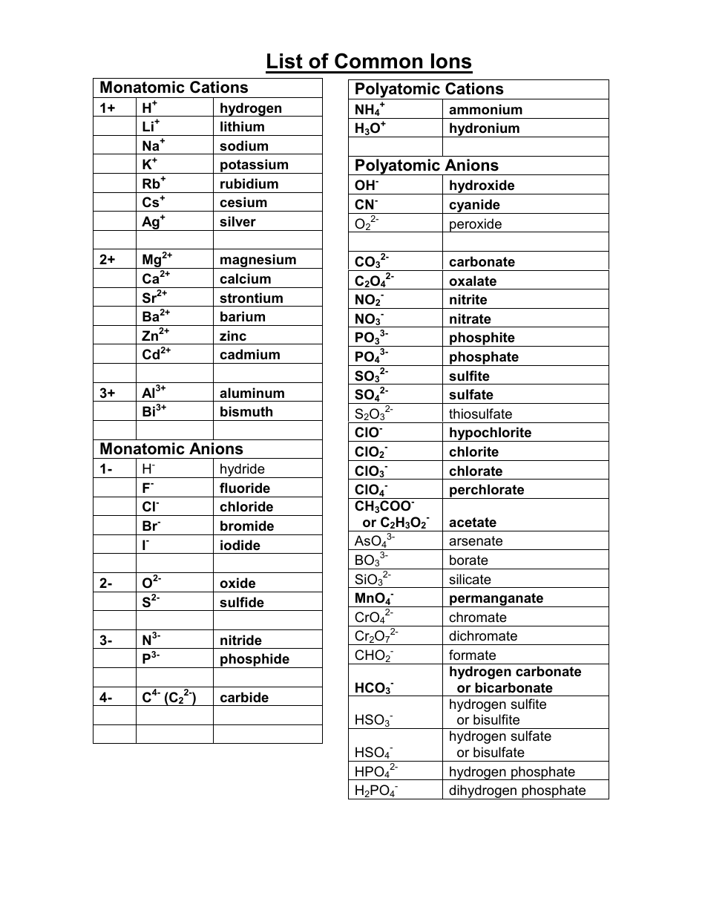

---
title: Nomenclature, Ions, and Formulae
---

# Nomenclature, Ions, and Formulae

## Basic terminology

- **Element** — a substance consisting of atoms with the same atomic number.
- **Atom** — the smallest unit of an element that retains its chemical identity.
- **Molecule** — two or more atoms chemically bonded together.
- **Compound** — a substance containing two or more different elements chemically combined.
- **Isotopes** — atoms of the same element with different numbers of neutrons.

## Ions

An ion is an atom or group of atoms with a net electric charge.

- **Cations** have a positive charge.
- **Anions** have a negative charge.

## Naming ions

Some common naming patterns include:

- Monatomic anions often end in **-ide**.
- Oxyanions commonly use **-ate** and **-ite** endings.
- **Bicarbonate** is the common name for the hydrogen carbonate ion, \(\mathrm{HCO_3^-}\).

Chemical formulae communicate which elements are present and their relative amounts.
