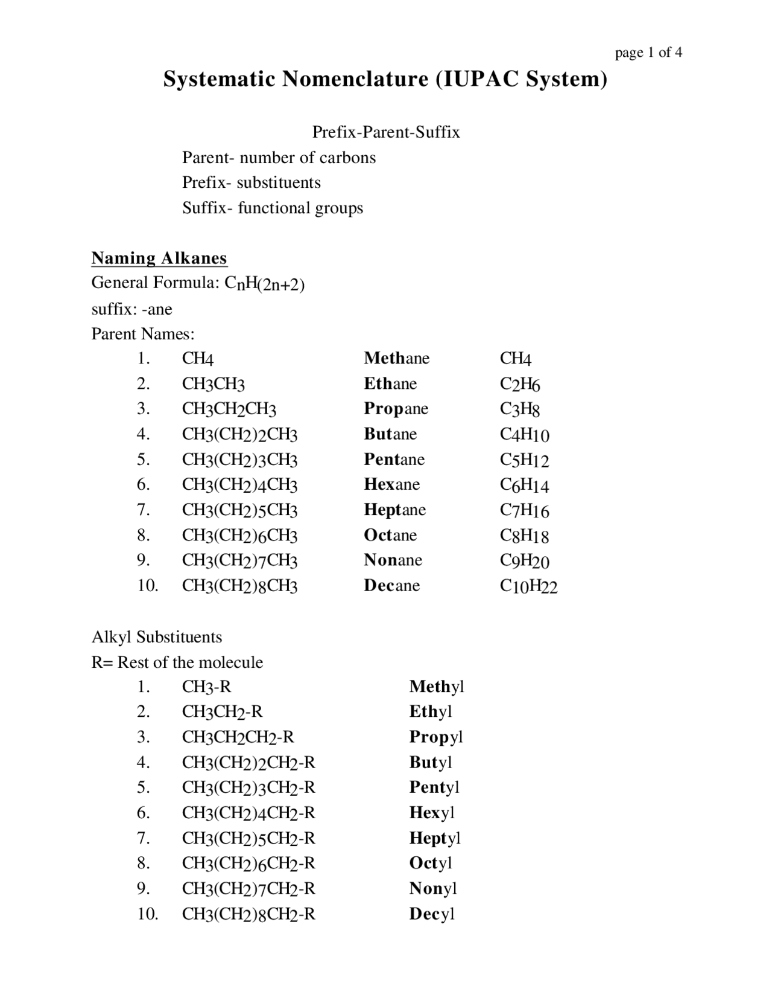

---
title: Organic Chemistry and IUPAC Naming
---

# Organic Chemistry and IUPAC Naming

Organic chemistry is the study of carbon-containing compounds, particularly compounds built around carbon frameworks and their functional groups.

## IUPAC nomenclature

The International Union of Pure and Applied Chemistry (IUPAC) provides systematic rules for naming chemical compounds.

The purpose of systematic nomenclature is to give compounds names that communicate their chemical structure.

