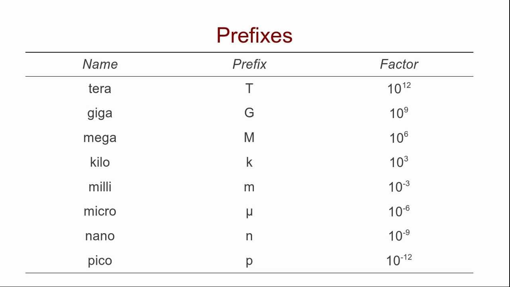
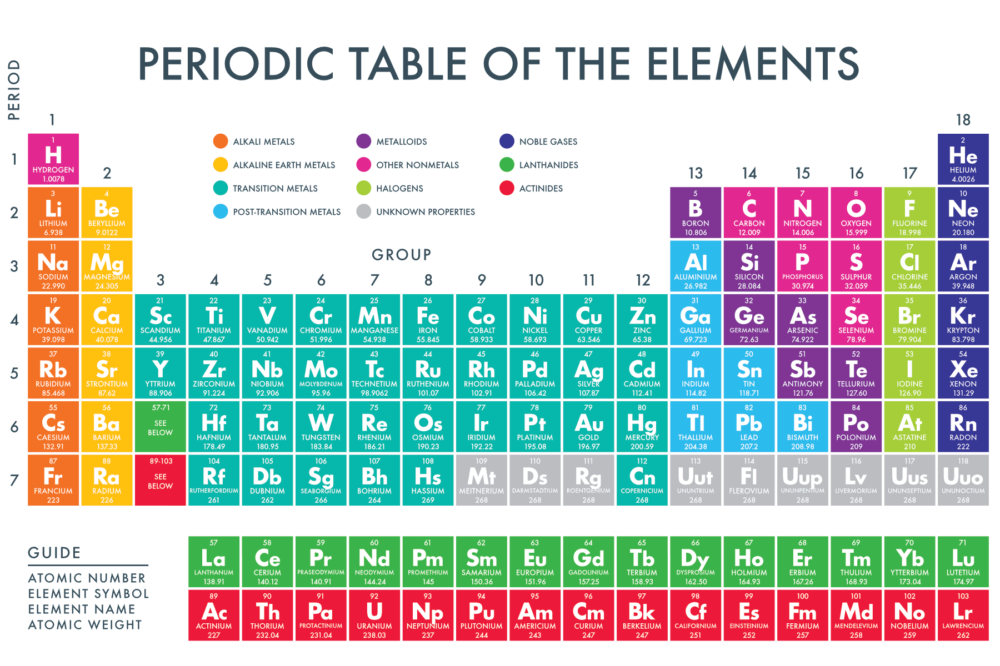

# Lecture 1

**Date:** Monday, August 31, 2026

### Lecture notes

### Lecture notes

## Scientific notation and dimensional analysis
Scientific notation writes a number as $a \times 10^n$, where $1 \leq |a| < 10$ and $n$ is an integer. It is useful for representing very large and very small values.

Dimensional analysis tracks units through a calculation. Units should cancel or combine to produce the units of the desired quantity.

## Atoms
An atom consists of a nucleus containing protons and neutrons, surrounded by electrons. Protons are positively charged, neutrons have no charge, and electrons are negatively charged.

- **Atomic number ($Z$):** the number of protons.
- **Mass number ($A$):** the total number of protons and neutrons.
- **Ion charge:** the number of protons minus the number of electrons.

## The periodic table
The periodic table organizes elements by atomic number and shows information such as their symbols, relative atomic masses, and chemical properties. Standard temperature and pressure (STP) are reference conditions, not properties listed for every element.

## States of matter and density
The three common states of matter are solid, liquid, and gas. Density relates mass and volume:

$$\rho = \frac{m}{V}$$

## Moles and mass
A mole is an amount of substance containing Avogadro's number of particles:

$$n = \frac{N}{N_A}, \qquad N_A = 6.022 \times 10^{23}\ \mathrm{mol^{-1}}$$

- Amount of substance: measured in moles ($\mathrm{mol}$)
- Mass: commonly measured in grams ($\mathrm{g}$)
- Molar mass: measured in grams per mole ($\mathrm{g/mol}$)

## Nomenclature, ions, and formulae
A chemical formula identifies the elements in a substance and uses subscripts to show how many atoms of each element are present.

- An **element** is defined by its number of protons.
- An **atom** is a single unit of an element.
- A **molecule** consists of two or more atoms held together by covalent bonds.
- A **compound** contains two or more different elements chemically bonded.
- **Isotopes** are atoms of the same element with different numbers of neutrons and therefore different mass numbers.
- **Ions** are atoms or groups of atoms with a net charge.
- **Cations** are positively charged ions; **anions** are negatively charged ions.
- Monatomic anions commonly end in **-ide**. Polyatomic anions commonly end in **-ate** or **-ite**.
- Some hydrogen-containing polyatomic anions use the prefix **bi-**, such as bicarbonate, $\mathrm{HCO_3^-}$.

### Organic chemistry and IUPAC naming

## Concentration
The molar concentration of a solution is the amount of solute per volume of solution:

$$c = \frac{n}{V}$$

Using $n = m/M$, where $M$ is molar mass:

$$c = \frac{m}{MV}, \qquad m = cMV$$

Here, $c$ is in $\mathrm{mol/L}$, $n$ is in mol, $V$ is in L, $m$ is in g, and $M$ is in $\mathrm{g/mol}$.

## Chemical bond types
Chemical bonds are attractions that hold atoms or ions together. The three main types are:

- **Ionic bonds:** electrons are transferred, usually from a metal to a non-metal, forming oppositely charged ions. The electrostatic attraction between the ions holds the crystal lattice together. Ionic compounds are typically hard, brittle solids with high melting points.
- **Covalent bonds:** atoms, usually non-metals, share pairs of electrons. A single, double, or triple bond represents one, two, or three shared electron pairs. Covalent substances can form discrete molecules or extended network structures.
- **Metallic bonds:** metal atoms contribute valence electrons to a shared, delocalized electron cloud. This helps explain the electrical and thermal conductivity, ductility, and malleability of metals.

Bond polarity depends on the difference in electronegativity between bonded atoms. A large difference produces a strongly polar bond, while a small difference produces a non-polar or weakly polar bond. Molecular polarity also depends on the shape of the molecule, not only on the individual bonds.

### Intermolecular forces
Intermolecular forces act between molecules and are weaker than the bonds within a molecule. Important examples include London dispersion forces, dipole-dipole forces, and hydrogen bonding. They influence boiling point, melting point, viscosity, and solubility.

# Lecture 2

<!-- Add the next lecture's notes below this heading. -->
