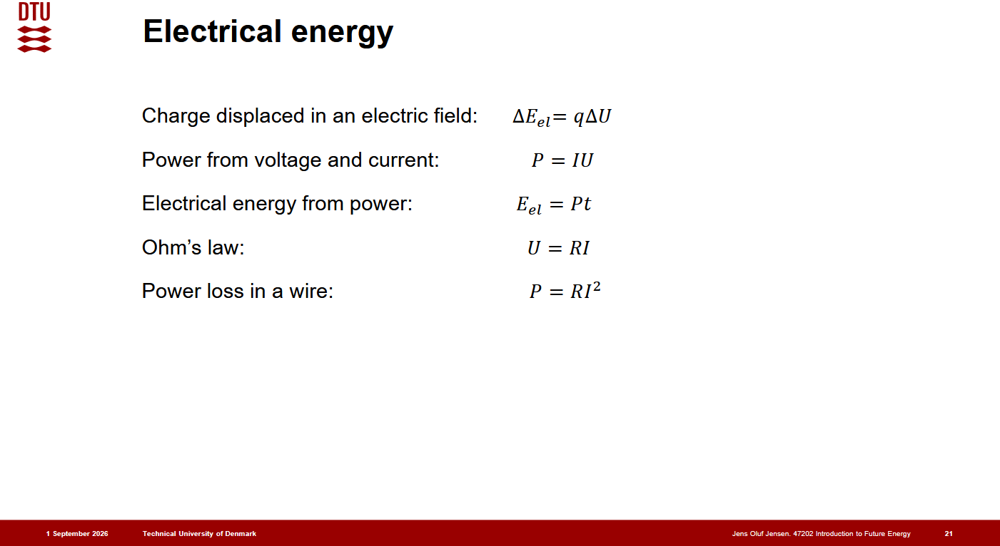

---
title: Electrical Energy
---

# Electrical Energy

Electrical energy arises from the electrostatic forces between charged particles and the flow of electric charge.

## Coulomb's law

The electrostatic force magnitude between two stationary point charges $q_1$ and $q_2$ separated by distance $r$ is:

$$
F = k_e\frac{|q_1 q_2|}{r^2}
$$

where $k_e \approx 8.988 \times 10^9\ \mathrm{N\cdot m^2/C^2}$ is Coulomb's constant.

