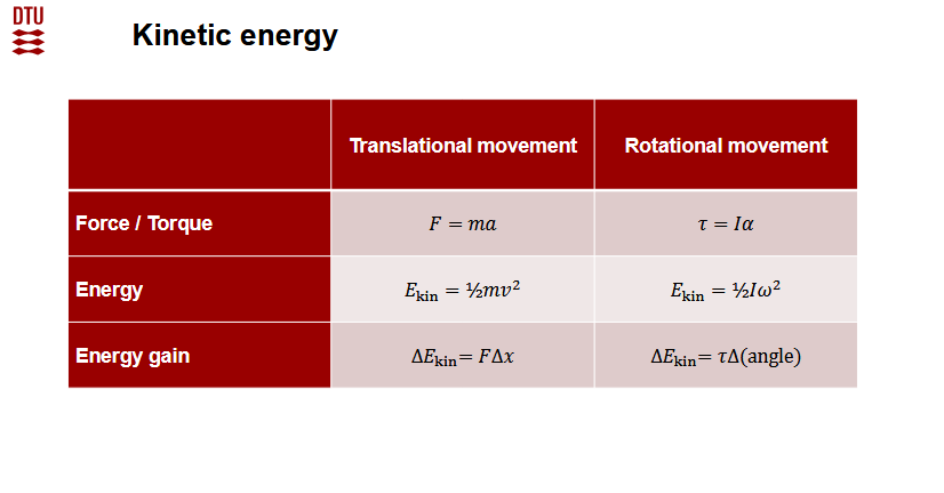
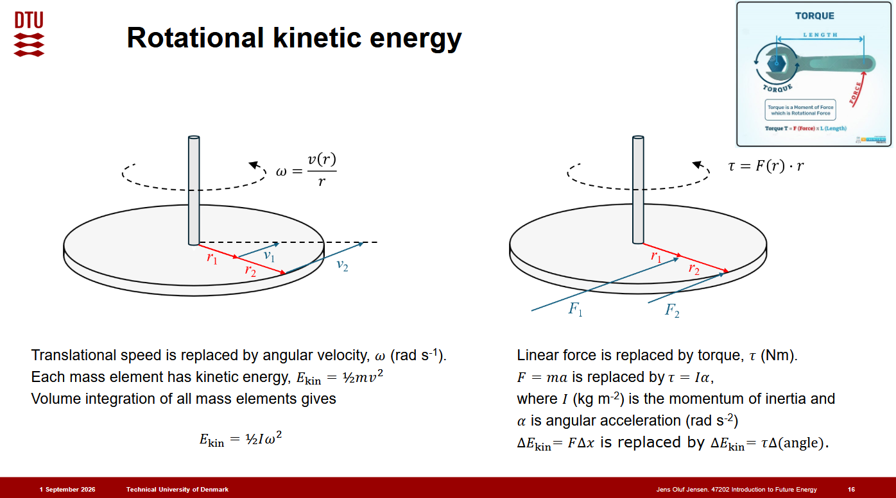
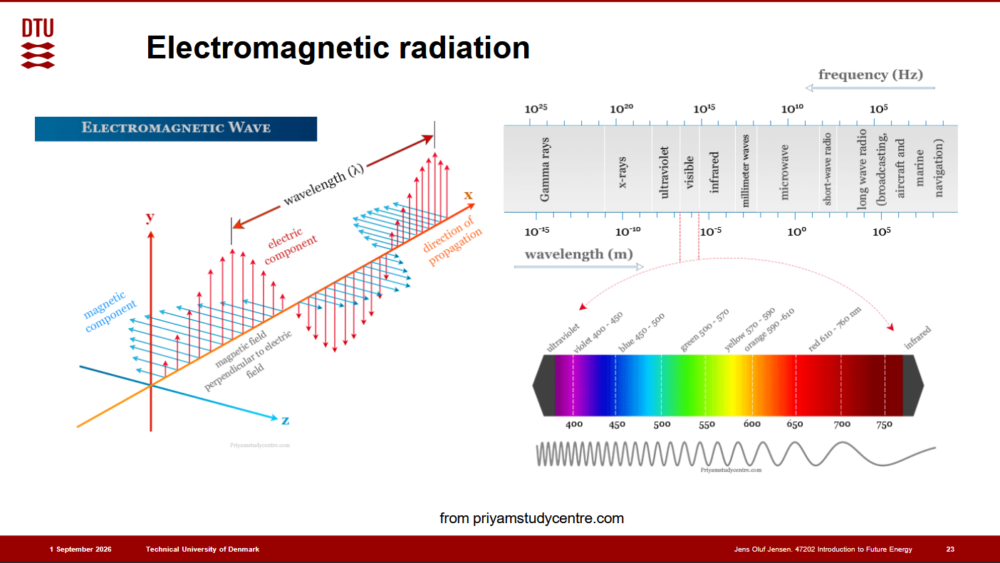
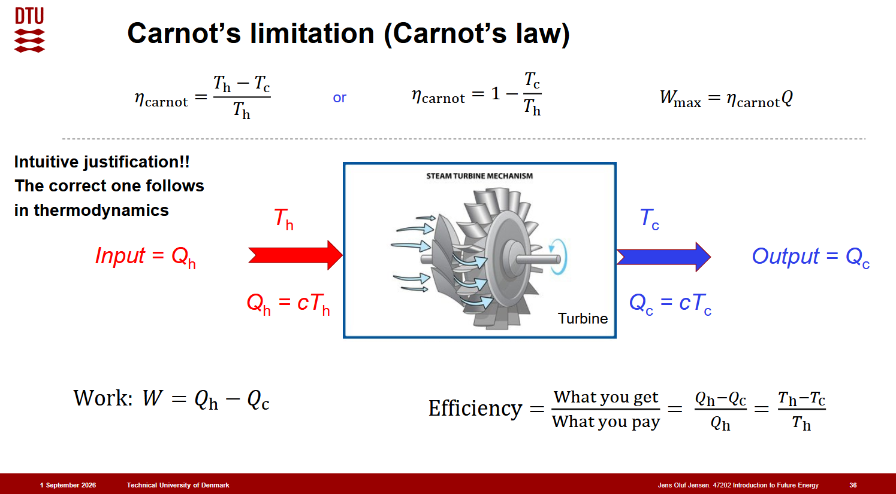

# Lecture 1

**Date:** Tuesday, September 1, 2026

## Energy
Energy is conserved: it cannot be created or destroyed, but it can be transferred or transformed. Energy is measured in joules ($\mathrm{J}$).

Common forms include kinetic, thermal, gravitational, chemical, electrical, electromagnetic, and nuclear energy. These forms can be understood through three useful scales:

1. **Macroscopic:** wind, heat transfer, hydropower, and tides.
2. **Molecular:** thermal motion and chemical reactions.
3. **Subatomic:** electromagnetic radiation, particle radiation, and nuclear reactions.

Four fundamental forms often used in this course are kinetic, gravitational, electrical, and nuclear energy.

## Work
Work is energy transferred when a force causes displacement. For a constant force parallel to the displacement:

$$W = F\,x$$

For a variable force:

$$W = \int_a^b F(x)\,dx$$

More generally, only the component of force along the displacement contributes to work.

## Force
A net force produces acceleration according to Newton's second law:

$$F_{\mathrm{net}} = ma$$

A force transfers energy through work when it causes displacement. A force acting without displacement does no mechanical work.

## Power
Power is the rate of energy transfer:

$$P = \frac{E}{t}$$

Instantaneous power is $P = dE/dt$.

## Newton's laws
1. An object remains at rest or moves at constant velocity unless acted upon by a net external force.
2. The net force on an object equals its mass multiplied by its acceleration, $F_{\mathrm{net}} = ma$.
3. When one body exerts a force on another, the second body exerts an equal and opposite force on the first.

## Kinetic energy
Translational kinetic energy is:

$$E_k = \frac{1}{2}mv^2$$

For rotational motion, the analogous expression is:

$$E_{k,\mathrm{rot}} = \frac{1}{2}I\omega^2$$

where $I$ is the moment of inertia and $\omega$ is angular velocity in radians per second.

## Gravitational energy
Newton's law of universal gravitation gives the magnitude of the force between two masses:

$$F = G\frac{m_1m_2}{r^2}$$

Near Earth's surface, the gravitational potential energy is:

$$E_{\mathrm{pot}} = mgh$$

where $g \approx 9.81\ \mathrm{m/s^2}$, $m$ is mass, and $h$ is height relative to a chosen reference level.

## Electrical energy
The magnitude of the electrostatic force between two point charges is:

$$F = k_e\frac{|q_1q_2|}{r^2}$$

Here, $k_e$ is Coulomb's constant, $q_1$ and $q_2$ are the charges, and $r$ is their separation.

## Electromagnetic radiation
Electromagnetic radiation transports energy through oscillating electric and magnetic fields.

## Nuclear energy
Mass and energy are related by Einstein's equation:

$$E = mc^2$$

where $c$ is the speed of light in vacuum. In nuclear reactions, a small mass difference can appear as a large energy release or absorption.

## SI units

## Capacity factor
Capacity factor (CF) measures the actual energy produced by a device relative to the energy it would produce if it operated continuously at rated power:

$$\mathrm{CF} = \frac{\text{actual energy produced}}{\text{rated power} \times \text{time}}$$

For a period $T$ with time-varying power:

$$\mathrm{CF} = \frac{\int_0^T P_{\mathrm{actual}}(t)\,dt}{P_{\mathrm{rated}}T}$$

## Higher and lower heating value
The **higher heating value (HHV)** includes the energy recovered when the water produced during combustion condenses to liquid. The **lower heating value (LHV)** excludes that latent heat and assumes the water remains as vapour. Therefore, HHV is greater than or equal to LHV.

## Ordered and disordered energy: work and heat
**Heat** is energy transferred because of a temperature difference and is associated with microscopic, disordered motion. **Work** is energy transferred through an organized macroscopic interaction, such as a force acting through a distance or an electrical potential driving charge.

## Pressure and expansion work
Pressure is force per unit area:

$$p = \frac{F}{A}$$

Its SI unit is the pascal, $1\ \mathrm{Pa} = 1\ \mathrm{N/m^2}$. For a system expanding against an external pressure, the differential boundary work is:

$$\delta W = p_{\mathrm{ext}}\,dV$$

The sign depends on the convention used. In thermodynamics, work done by the system is often written $W = \int p_{\mathrm{ext}}\,dV$.

## Ideal gas law
The ideal gas law is:

$$pV = nRT$$

where $p$ is pressure, $V$ is volume, $n$ is amount of gas, $R$ is the gas constant, and $T$ is absolute temperature in kelvin. The model assumes point-like particles with negligible volume and no intermolecular forces except during elastic collisions.

## Efficiency and Carnot's limitation
Efficiency compares useful energy output with energy input:

$$\eta = \frac{\text{useful energy output}}{\text{energy input}}$$

The maximum theoretical efficiency of a reversible heat engine operating between hot and cold reservoirs is the Carnot efficiency:

$$\eta_{\mathrm{Carnot}} = 1 - \frac{T_c}{T_h} = \frac{T_h - T_c}{T_h}$$

Temperatures must be measured in kelvin.

## First law of thermodynamics
The first law is the conservation of energy applied to a thermodynamic system:

$$\Delta U = Q - W_{\mathrm{by}}$$

Here, $\Delta U$ is the change in internal energy, $Q$ is heat added to the system, and $W_{\mathrm{by}}$ is work done by the system. If using the convention that $W_{\mathrm{on}}$ is work done on the system, the same law is written:

$$\Delta U = Q + W_{\mathrm{on}}$$

Internal energy depends on the state of the system. Heat and work are energy transfers, not properties stored in the system.

## Entropy
Entropy measures how energy is distributed among the microscopic states available to a system. For a reversible heat transfer:

$$dS = \frac{\delta Q_{\mathrm{rev}}}{T}$$

The second law of thermodynamics states that the total entropy of an isolated system cannot decrease:

$$\Delta S_{\mathrm{universe}} \geq 0$$

A reversible process has $\Delta S_{\mathrm{universe}} = 0$; an irreversible process has $\Delta S_{\mathrm{universe}} > 0$. Entropy explains why real processes have a preferred direction and why no heat engine can convert all input heat into useful work.

# Lecture 2

<!-- Add the next lecture's notes below this heading. -->
