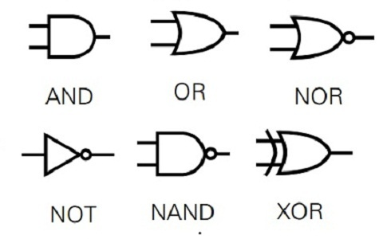

# Lecture 1

**Date:** Wednesday, September 2, 2026

"Mathematics is the only exact science" (very happy) \\
Mathematics is based on axioms: statements we assume to be true. \\
Mathematics is both descriptive and predictive.

## Propositions
A proposition is a statement with a truth value: true or false, represented by $1$ or $0$. Examples include $3 > 2$ and $1 = 5$.

A propositional function (or predicate) contains variables, such as $x = 2$ or $x^2 = y - 1$. It does not have a truth value until values are assigned to its variables.

## Truth values
Consider a padlock with three dials:

- $P$: $x = 3$
- $Q$: $y = 4$
- $R$: $z = 7$

Each proposition can be either true ($T$) or false ($F$). For $n$ propositions, there are $2^n$ possible combinations of truth values.

| $P$ | $Q$ | $R$ |
|:---:|:---:|:---:|
| $T$ | $T$ | $T$ |
| $T$ | $T$ | $F$ |
| $T$ | $F$ | $T$ |
| $T$ | $F$ | $F$ |
| $F$ | $T$ | $T$ |
| $F$ | $T$ | $F$ |
| $F$ | $F$ | $T$ |
| $F$ | $F$ | $F$ |

## Logical operations
A **conjunction** (AND, written $\land$) is true only when every proposition is true:

$$P \land Q \land R$$

A **disjunction** (OR, written $\lor$) is true when at least one proposition is true:

$$P \lor Q$$

A **negation** (NOT, written $\neg$) reverses a proposition's truth value. For example, $\neg P$ is true exactly when $P$ is false.

## Logical equivalence
Two propositions are **logically equivalent** when they have the same truth value in every possible case. This is written $\iff$.

The expression $(Q \land \neg P) \lor P$ is logically equivalent to $Q \lor P$:

| $P$ | $Q$ | $\neg P$ | $Q \land \neg P$ | $(Q \land \neg P) \lor P$ | $Q \lor P$ |
|:---:|:---:|:---:|:---:|:---:|:---:|
| $T$ | $T$ | $F$ | $F$ | $T$ | $T$ |
| $T$ | $F$ | $F$ | $F$ | $T$ | $T$ |
| $F$ | $T$ | $T$ | $T$ | $T$ | $T$ |
| $F$ | $F$ | $T$ | $F$ | $F$ | $F$ |

Useful logical identities include:

- $P \land P \iff P$ (idempotent law)
- $P \lor P \iff P$ (idempotent law)
- $P \land Q \iff Q \land P$ (commutative law)
- $P \lor Q \iff Q \lor P$ (commutative law)

### De Morgan's laws
Negating a conjunction changes it into a disjunction of negations, and negating a disjunction changes it into a conjunction of negations:

$$\neg(P \land Q) \iff \neg P \lor \neg Q$$
$$\neg(P \lor Q) \iff \neg P \land \neg Q$$

For Boolean values, multiplication corresponds to $\land$, while addition with values restricted to $0$ and $1$ corresponds to $\lor$ when the result is capped at $1$.

## Logical consequence
A proposition $Q$ is a **logical consequence** of $P$ when the implication $P \to Q$ is a tautology. In other words, every situation that makes $P$ true also makes $Q$ true.

## Implications
An implication $P \to Q$ means "if $P$, then $Q$." It is false only when $P$ is true and $Q$ is false. If $P$ is false, the implication is true because the condition has not been violated.

| $P$ | $Q$ | $P \to Q$ |
|:---:|:---:|:---:|
| $T$ | $T$ | $T$ |
| $T$ | $F$ | $F$ |
| $F$ | $T$ | $T$ |
| $F$ | $F$ | $T$ |

A **biconditional** (or biimplication) is written $P \iff Q$. It is true when $P$ and $Q$ have the same truth value; equivalently, $(P \to Q) \land (Q \to P)$ is true.

| $P$ | $Q$ | $P \iff Q$ |
|:---:|:---:|:---:|
| $T$ | $T$ | $T$ |
| $T$ | $F$ | $F$ |
| $F$ | $T$ | $F$ |
| $F$ | $F$ | $T$ |

## Tautologies
A **tautology** is a proposition that is true in every possible case. For example:

$$\neg P \lor P \iff \top$$

| $P$ | $\neg P$ | $\neg P \lor P$ |
|:---:|:---:|:---:|
| $T$ | $F$ | $T$ |
| $F$ | $T$ | $T$ |

Also, $P \land \top \iff P$.

## Contradictions
A **contradiction** is a proposition that is false in every possible case. For example:

$$\neg P \land P \iff \bot$$

| $P$ | $\neg P$ | $\neg P \land P$ |
|:---:|:---:|:---:|
| $T$ | $F$ | $F$ |
| $F$ | $T$ | $F$ |

Also, $P \land \bot \iff \bot$.

## Proof methods
A proof is a logically valid argument showing that a statement follows from definitions, axioms, and previously established results.

### Direct proof
To prove $P \to Q$ directly, assume that $P$ is true and use logical steps to derive $Q$.

Example structure:

1. Assume $P$.
2. Apply definitions, algebra, or known results.
3. Conclude $Q$.

### Proof by contrapositive
The implication $P \to Q$ is logically equivalent to its contrapositive:

$$P \to Q \iff \neg Q \to \neg P$$

To prove $P \to Q$ by contrapositive, assume $\neg Q$ and show that $\neg P$ follows. This is especially useful when $\neg Q$ is easier to work with than $P$.

Example: If $n^2$ is even, then $n$ is even. Rather than proving this directly, prove the contrapositive: if $n$ is odd, then $n^2$ is odd.

### Proof by contradiction
To prove a statement $P$, assume that $\neg P$ is true and derive a contradiction. Since the assumption leads to an impossibility, $P$ must be true.

### Common logical distinctions
For the implication $P \to Q$:

- **Converse:** $Q \to P$. It is not automatically equivalent to the original implication.
- **Inverse:** $\neg P \to \neg Q$. It is not automatically equivalent to the original implication.
- **Contrapositive:** $\neg Q \to \neg P$. It is always logically equivalent to $P \to Q$.

A useful habit is to state the assumptions, justify each step, and clearly identify the conclusion.

# Lecture 2

<!-- Add the next lecture's notes below this heading. -->
